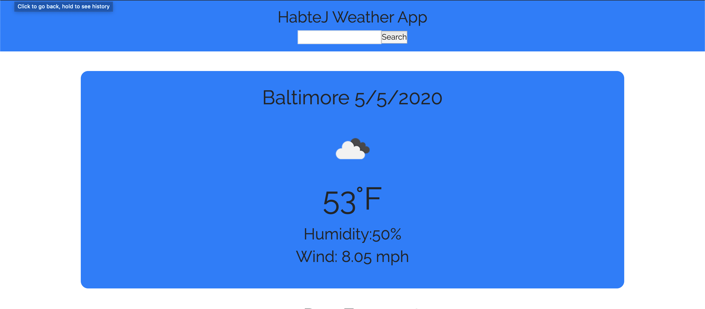
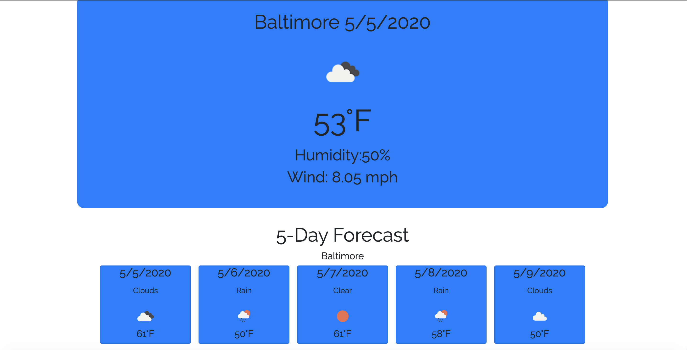
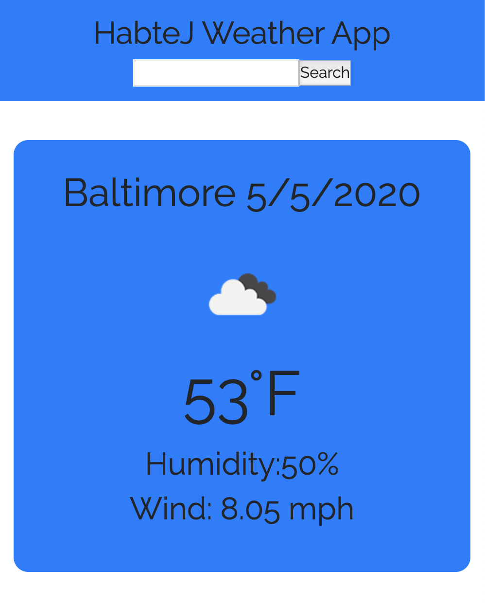
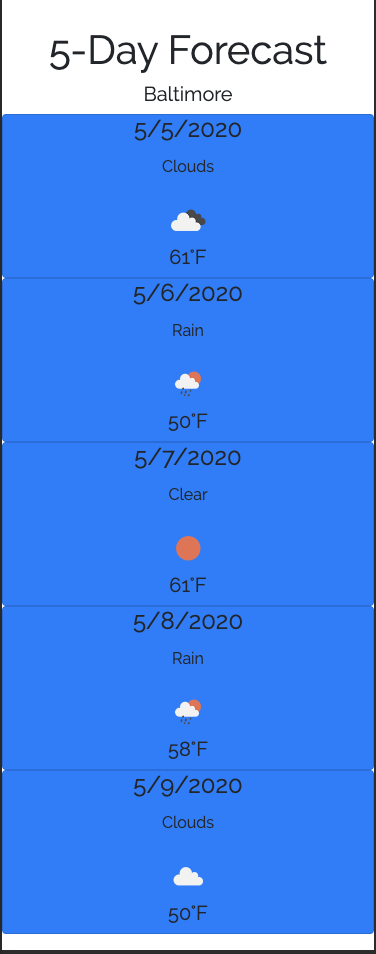

# JH Weather App

## About
A dashboard weather application built with React JS and a responsive Bootstrap UI that pulls weather data from the Open Weather API. 
This application is hosted and can be accessed at the following [link.](https://jhweather.netlify.app/)

## Usage
When the user first starts the application they will be shown the current weather data and 5 day forecast for Baltimore City by default. The user can then enter a new city in the search bar and the application will update the UI with the newly selected city's current weather data and 5 day forecast.

## Technologies Used
* React JS
* Axios
* Open Weather API
* Bootstrap

## License

This application is licensed under the GNU General Public license. The license can be found in this project's root directory.
