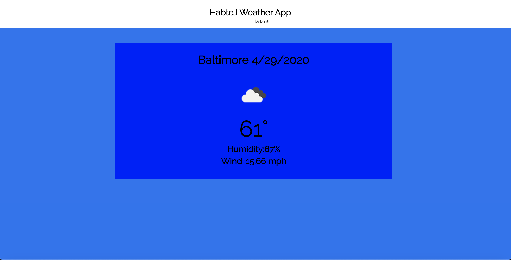
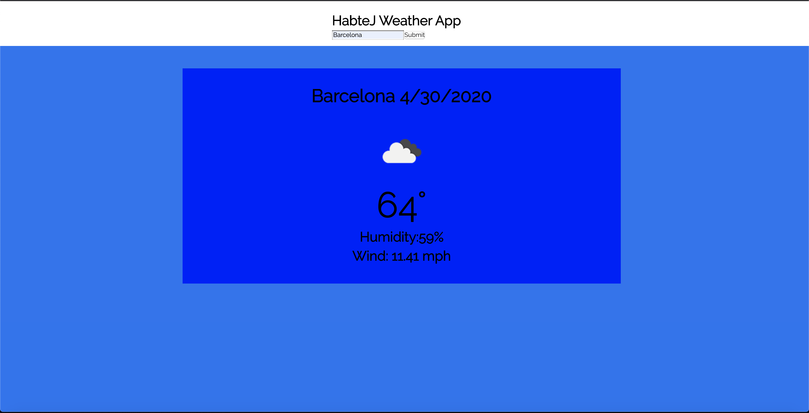

# JH Weather App

## About
A dashboard weather application built with React JS that pulls weather data from the Open Weather API 
This application is hosted and can be accessed at the following [link.](https://jhweather.netlify.app/)

## Usage
When the user first starts the application they will be shown the weather data for Baltimore City by default. The user can then enter a new city in the search bar and the application will update the weather component to show that city's weather data.

## Technologies Used
* React JS
* Axios
* Open Weather API